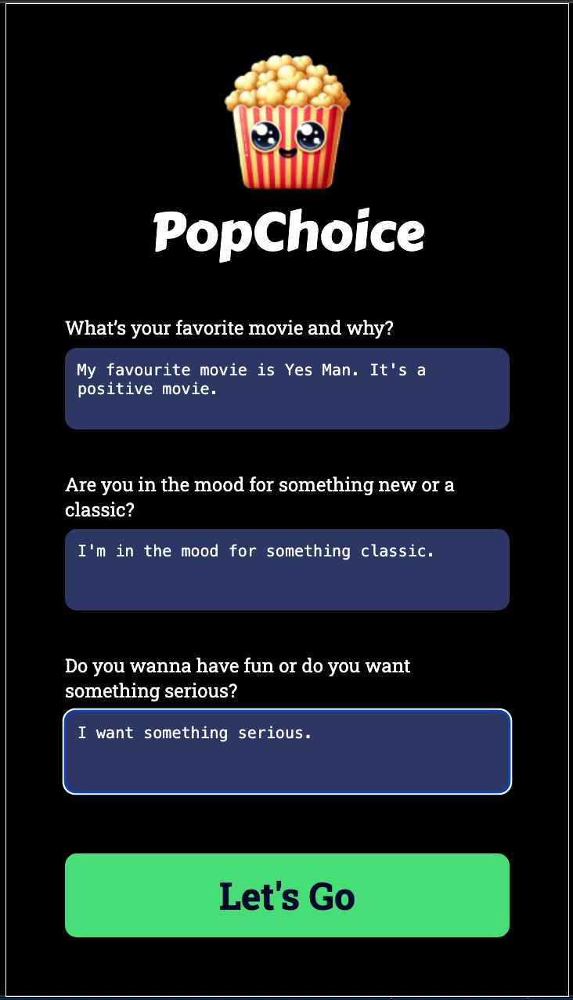
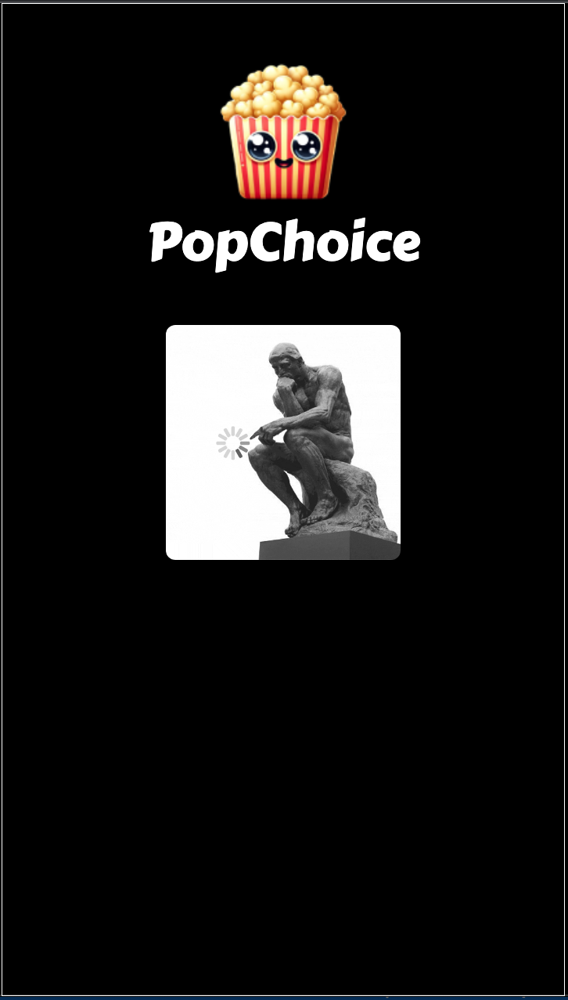
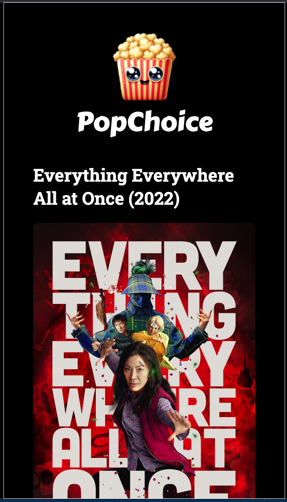
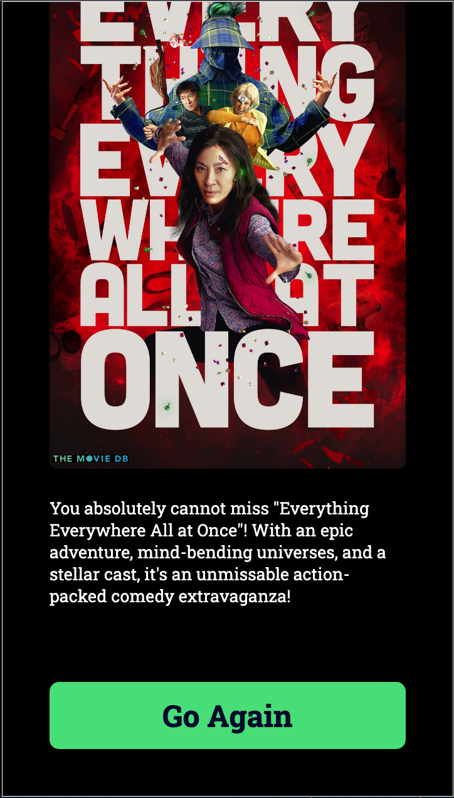

# PopChoice!
An AI-powered movie recommendations app, built with React and powered with OpenAI API, embeddings, RAG, Supabase, and the Movie DB API.

## In This Document:
1. [Live Application URL](#live-application-url)
2. [How to Use the Application](#how-to-use-the-application)
3. [Technologies Used](#technologies-used)
4. [Future Features](#future-features)
5. [Challenges and Learning Points](#challenges-and-learning-points)

## Live Application URL
https://popchoice.netlify.app/

## How to Use the Application
1. User answers 3 questions about the movies like like and what're they're in the mood for.
2. User clicks on Let's GO!
3. Recommended movie poster should get displayed with info.
5. User can start over.

## Technologies Used
1. HTML, CSS, and React.
2. [OpenAI API](https://platform.openai.com/).
3. [Supabase](https://supabase.com/).
4. [The Movie DB API](https://www.themoviedb.org/).
5. Vite for building and packaging.

## Future Features:
1. Add error handling and backup movie and poster.
2. Add questions for rating and movie length.

## Challenges and Learning Points:
1. Implementing the full RAG workflow by retrieving the movie from the supabase db and then passing it to OpenAI for generating an enthusiastic recommendation and text processing.

[Up](README.md)
